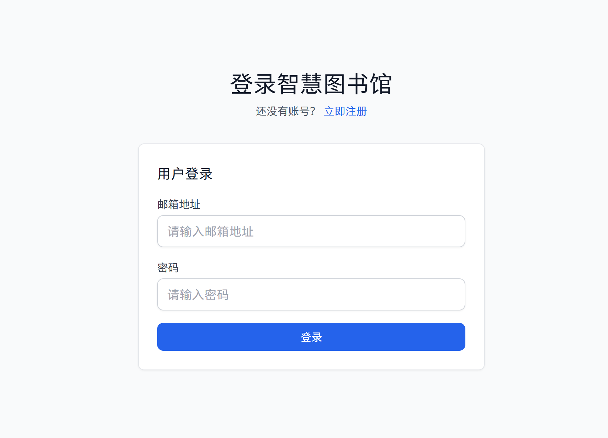
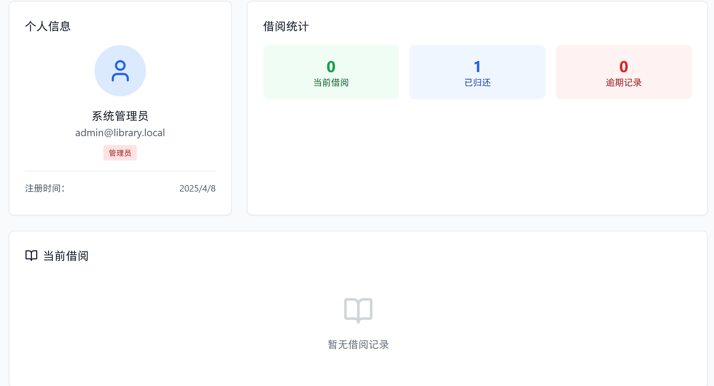
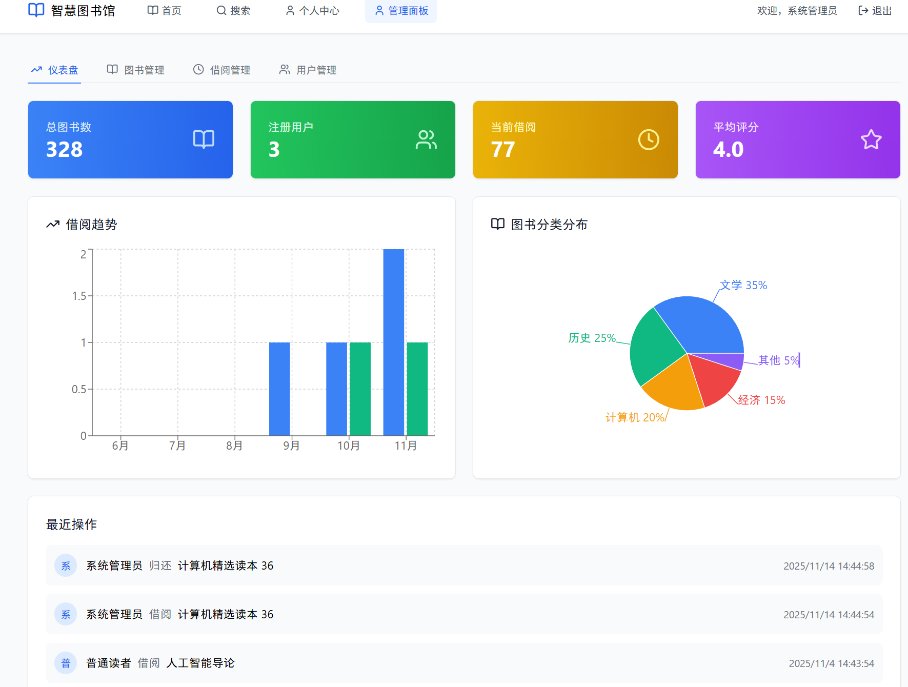
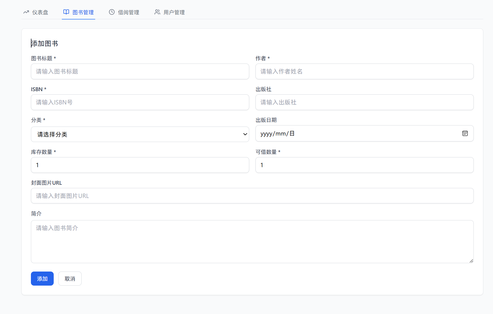

# 智慧图书馆管理系统

基于 React 18 + TypeScript + Vite 构建的现代化图书馆管理单页应用，使用 localStorage 作为本地数据库，实现完整的图书借阅与管理功能，无需后端服务器即可独立运行。

## 核心特性

### 📚 完整的图书管理
- **图书浏览**：首页展示热门图书（按评分排序）和新书上架（按出版时间排序）
- **高级搜索**：支持标题、作者、ISBN 等关键词模糊搜索
- **多维筛选**：15+ 分类筛选（文学、历史、哲学、计算机等）
- **灵活排序**：按标题、作者、评分、评论数、出版日期排序，支持升序/降序
- **分页浏览**：可自定义每页显示 10/20/30 条记录
- **双视图模式**：网格视图和列表视图自由切换

### 👥 双角色权限体系
- **用户认证**：邮箱注册/登录，JWT 风格的会话管理（基于 Zustand）
- **角色区分**：管理员（admin）和普通读者（user）
- **权限控制**：路由守卫确保管理功能仅管理员可访问
- **个人中心**：查看个人信息、当前借阅、历史记录

### 🔄 完善的借阅流程
- **借阅管理**：一键借阅，自动更新图书库存和可用数量
- **智能续借**：支持续借功能，每本书最多续借 2 次
- **归还处理**：归还图书后自动恢复库存
- **状态追踪**：实时显示借阅中、已逾期、已归还等状态
- **逾期提醒**：自动标识逾期图书（30天借期）
- **借阅历史**：完整记录用户的所有借阅行为

### ⭐ 读者互动系统
- **图书评分**：5 星评分系统
- **评论功能**：用户可发表图书评论
- **实时统计**：自动计算平均评分和评论数量
- **详情展示**：图书详情页显示所有评论和评分

### 📊 管理员仪表盘
- **核心指标**：总图书数、注册用户、当前借阅、平均评分
- **借阅趋势**：柱状图展示近 6 个月的借阅/归还趋势
- **分类分布**：饼图展示图书分类占比
- **最近操作**：实时显示最近的借阅和归还活动
- **图书管理**：完整的图书增删改查功能


## 界面预览









## 技术栈

### 前端框架
- **React 18**：采用 Hooks 和函数式组件
- **TypeScript**：完整的类型定义，提供开发时类型检查
- **Vite**：极速的开发服务器和构建工具

### UI 与样式
- **Tailwind CSS 3**：实用优先的 CSS 框架
- **Lucide React**：美观的 React 图标库
- **自定义组件**：Card、Button、Input 等基础 UI 组件

### 状态管理
- **Zustand**：轻量级状态管理，用于全局认证状态

### 数据可视化
- **Recharts**：基于 React 的图表库，用于仪表盘数据展示

### 路由
- **React Router v7**：单页应用路由管理，支持受保护路由

### 通知系统
- **Sonner**：优雅的 Toast 通知组件

### 工具库
- **uuid**：生成唯一标识符
- **clsx + tailwind-merge**：动态 className 管理

## 快速开始

### 环境要求
- Node.js >= 16
- npm 或 pnpm

### 安装依赖
```bash
git clone <repository-url>
cd library
npm install
```

### 启动开发服务器
```bash
npm run dev
```

访问 `http://localhost:5173` 即可使用应用。

### 构建生产版本
```bash
npm run build
```

### 预览生产构建
```bash
npm run preview
```

> **首次启动说明**：应用会自动在 localStorage 中初始化演示数据（键名：`library-local-db`），包含 50+ 本示例图书和默认账户。删除该键可重置所有数据。

## 可用脚本

| 命令 | 说明 |
|------|------|
| `npm run dev` | 启动 Vite 开发服务器（默认端口 5173） |
| `npm run build` | TypeScript 编译 + Vite 生产构建 |
| `npm run preview` | 预览生产构建结果 |
| `npm run lint` | 运行 ESLint 代码检查 |
| `npm run check` | TypeScript 类型检查（不输出文件） |

## 测试账号

| 角色 | 邮箱 | 密码 | 说明 |
|------|------|------|------|
| 管理员 | `admin@library.local` | `admin123` | 可访问管理面板，管理图书 |
| 普通读者 | `user1@library.local` | `password123` | 可借阅图书、评分评论 |
| 普通读者 | `user2@library.local` | `password123` | 测试用户 2 |

> 💡 提示：也可以通过注册页面创建新账户，新用户默认为普通读者角色。

## 项目结构

```
d:\3D\library/
├── src/
│   ├── components/              # UI 组件
│   │   ├── ui/                 # 基础组件（Button, Card, Input）
│   │   ├── BookCard.tsx        # 图书卡片组件
│   │   ├── BookForm.tsx        # 图书表单（新增/编辑）
│   │   ├── BookManagement.tsx  # 图书管理组件
│   │   ├── Empty.tsx           # 空状态组件
│   │   ├── Layout.tsx          # 主布局（导航栏、页脚）
│   │   ├── RatingStars.tsx     # 星级评分组件
│   │   ├── SearchBar.tsx       # 搜索框组件
│   │   └── ToastProvider.tsx   # Toast 通知提供者
│   │
│   ├── hooks/                   # 自定义 Hooks
│   │   ├── useAdminDashboardData.ts  # 管理仪表盘数据
│   │   ├── useAuth.ts          # 认证状态管理（Zustand）
│   │   ├── useAuthActions.ts   # 认证操作（登录/注册/登出）
│   │   ├── useBooks.ts         # 图书数据获取
│   │   ├── useBorrowRecords.ts # 借阅记录管理
│   │   ├── useLibraryStats.ts  # 图书馆统计数据
│   │   ├── useReviews.ts       # 评论数据管理
│   │   └── useTheme.ts         # 主题管理
│   │
│   ├── lib/                     # 工具库
│   │   ├── localDatabase.ts    # 本地数据库实现
│   │   └── utils.ts            # 工具函数（日期格式化、分类等）
│   │
│   ├── pages/                   # 页面组件
│   │   ├── Home.tsx            # 首页（热门图书、新书）
│   │   ├── Search.tsx          # 搜索页（筛选、排序、分页）
│   │   ├── BookDetail.tsx      # 图书详情页（借阅、评分、评论）
│   │   ├── Profile.tsx         # 个人中心（借阅记录）
│   │   ├── Admin.tsx           # 管理面板（仪表盘、图书管理）
│   │   ├── Login.tsx           # 登录页
│   │   └── Register.tsx        # 注册页
│   │
│   ├── types/                   # TypeScript 类型定义
│   │   └── index.ts            # 所有接口定义
│   │
│   ├── App.tsx                  # 根组件（路由配置）
│   ├── main.tsx                 # 应用入口
│   └── index.css                # 全局样式（Tailwind 指令）
│
├── public/                      # 静态资源
├── pictures/                    # 界面截图
├── .trae/                       # 文档目录
│   └── documents/
│       └── library_technical_architecture.md
│
├── eslint.config.js             # ESLint 配置
├── tailwind.config.js           # Tailwind CSS 配置
├── tsconfig.json                # TypeScript 配置
├── vite.config.ts               # Vite 配置
├── postcss.config.js            # PostCSS 配置
└── package.json                 # 项目依赖和脚本
```

## 核心功能说明

### 1. 本地数据库 (localDatabase.ts)

本项目使用 `localStorage` 模拟完整的数据库功能：

**初始化函数**
- `initializeLocalDatabase()` - 初始化数据库，写入种子数据

**用户相关**
- 支持用户注册、登录（密码哈希存储）
- 区分管理员和普通用户权限

**图书相关**
- `getBooksFromLocalDb(filters, pagination)` - 支持搜索、筛选、排序、分页
- `getBookByIdFromLocalDb(id)` - 获取图书详情
- `createBookInLocalDb(payload)` - 新增图书
- `updateBookInLocalDb(id, payload)` - 更新图书
- `deleteBookFromLocalDb(id)` - 删除图书

**借阅相关**
- `borrowBookInLocalDb(bookId, userId)` - 借阅图书
- `renewBorrowRecordInLocalDb(recordId)` - 续借图书
- `returnBorrowRecordInLocalDb(recordId, bookId)` - 归还图书
- `getBorrowRecordsFromLocalDb(userId)` - 获取借阅记录

**评论相关**
- `getReviewsForBookFromLocalDb(bookId)` - 获取图书评论
- `addReviewToLocalDb(payload)` - 添加评论

**统计相关**
- `getLibraryStatsFromLocalDb()` - 获取图书馆统计数据
- `getAdminDashboardDataFromLocalDb()` - 获取仪表盘数据（趋势、分布等）

### 2. 路由配置

```typescript
/                   # 首页（公开）
/search             # 搜索页（公开）
/book/:id           # 图书详情（公开）
/login              # 登录（公开）
/register           # 注册（公开）
/profile            # 个人中心（需登录）
/admin              # 管理面板（需管理员权限）
```

### 3. 图书分类

系统支持以下 15 个分类：
- 文学 (Literature)
- 历史 (History)
- 哲学 (Philosophy)
- 艺术 (Art)
- 科学 (Science)
- 技术 (Technology)
- 计算机 (Computer Science)
- 经济 (Economics)
- 法律 (Law)
- 教育 (Education)
- 医学 (Medicine)
- 农业 (Agriculture)
- 工业 (Industry)
- 交通 (Transportation)
- 环境 (Environment)

### 4. 借阅规则

- **借期**：30 天
- **续借**：每本书最多续借 2 次，每次延长 30 天
- **逾期**：超过归还日期自动标记为逾期状态
- **库存**：借阅时减少可用数量，归还时恢复

## 数据存储结构

所有数据存储在 `localStorage` 的 `library-local-db` 键中，结构如下：

```typescript
{
  users: User[]           // 用户列表
  books: Book[]           // 图书列表
  borrowRecords: BorrowRecord[]  // 借阅记录
  reviews: Review[]       // 评论列表
}
```

## 开发指南

### 添加新功能

1. **定义类型**：在 `src/types/index.ts` 中添加 TypeScript 接口
2. **数据层**：在 `src/lib/localDatabase.ts` 中添加数据操作函数
3. **业务逻辑**：在 `src/hooks/` 中创建自定义 Hook
4. **UI 组件**：在 `src/components/` 或 `src/pages/` 中实现界面

### 替换为真实后端

本项目的数据层已经封装，替换后端只需：

1. 将 `src/lib/localDatabase.ts` 中的函数改为 API 调用
2. 保持函数签名和返回格式不变
3. 其他代码无需修改

示例：
```typescript
// 当前（localStorage）
export const getBooksFromLocalDb = async (filters, pagination) => {
  const db = getDb()
  // ... 本地过滤逻辑
  return { books, total }
}

// 改为后端 API
export const getBooksFromLocalDb = async (filters, pagination) => {
  const response = await fetch('/api/books', {
    method: 'POST',
    body: JSON.stringify({ filters, pagination })
  })
  return response.json()
}
```

## 常见问题

### 如何重置数据？
在浏览器控制台执行：
```javascript
localStorage.removeItem('library-local-db')
```
然后刷新页面，系统会自动重新初始化演示数据。

### 如何修改默认管理员？
编辑 `src/lib/localDatabase.ts` 中的 `initializeLocalDatabase` 函数，修改默认用户数据。

### 如何添加更多示例图书？
在 `src/lib/localDatabase.ts` 中的 `sampleBooks` 数组添加图书数据。

## 技术亮点

- ✅ **完整的 TypeScript 类型**：所有数据和函数都有类型定义
- ✅ **模块化设计**：组件、Hooks、工具函数清晰分离
- ✅ **响应式设计**：移动端、平板、桌面端完美适配
- ✅ **性能优化**：虚拟滚动、懒加载、防抖搜索
- ✅ **用户体验**：加载状态、错误处理、操作反馈
- ✅ **代码规范**：ESLint + TypeScript 严格模式

## 后续规划

### 功能增强
- [ ] 图书批量导入/导出（CSV、JSON）
- [ ] 借阅管理模块（管理员审核、延期申请）
- [ ] 用户管理模块（用户列表、权限管理、禁用账户）
- [ ] 图书预约功能（库存不足时预约）
- [ ] 邮件通知（逾期提醒、预约通知）
- [ ] 高级搜索（多条件组合、全文搜索）
- [ ] 个性化推荐（基于借阅历史）
- [ ] 数据导出报表（借阅统计、用户行为分析）

### 技术优化
- [ ] 接入真实后端 API
- [ ] 添加单元测试和集成测试
- [ ] 实现服务端渲染（SSR）
- [ ] 添加 PWA 支持（离线可用）
- [ ] 国际化支持（i18n）
- [ ] 主题切换（深色模式）

## 贡献指南

欢迎提交 Issue 和 Pull Request！

## 许可证

MIT License

---

**开发团队** | 2025年 | 智慧图书馆管理系统
