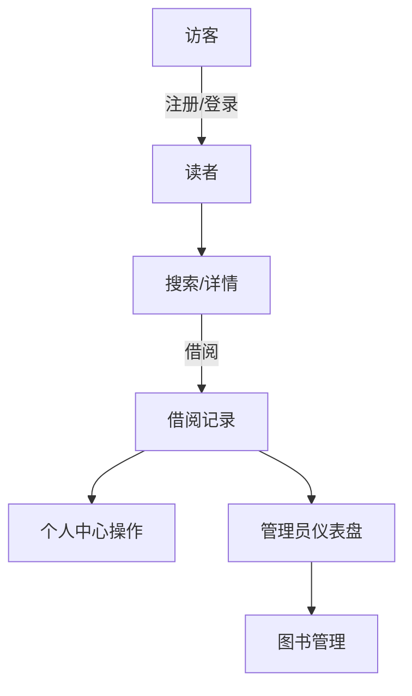

## 1. 产品概述
智慧图书馆管理系统面向中小型图书馆或校园阅览室，提供“读者自助 + 管理人员运维”一体化体验。整套系统运行在浏览器侧，借助内置本地数据库完成数据模拟，便于快速演示、验证流程或离线培训。

## 2. 用户与权限
| 角色 | 获取方式 | 核心权限 |
|------|----------|----------|
| 管理员 | 系统预置账号（可扩展） | 仪表盘、图书 CRUD、借阅统计、用户概览 |
| 普通读者 | 邮箱注册 | 浏览/搜索、借阅/续借/归还、撰写评价、查看个人记录 |

权限特性：
- 登录状态保存在本地 store 中，刷新页面后会自动校验。
- 路由守卫确保 `/profile` 仅登录用户可访问，`/admin` 仅管理员可访问。

## 3. 功能模块
### 3.1 读者侧
- **首页/Home**：精品推荐、快捷搜索入口。
- **搜索/Search**：关键词、分类、排序、分页浏览图书，展示库存与评分。
- **图书详情**：封面简介、库存、借阅状态；支持借阅/续借/归还与读者评论。
- **评价系统**：星级评分 + 文本评论，实时刷新平均分。
- **个人中心/Profile**：显示当前借阅、历史记录、借阅统计，并在卡片上直接续借/归还。

### 3.2 管理员侧
- **仪表盘**：总图书册数、注册用户数、当前借阅、平均评分；借阅趋势柱状图、图书分类饼图、最近借阅/归还流水。
- **图书管理**：检索、分页列表、添加/编辑/删除图书，支持封面 URL、库存、分类等字段。
- **借阅/用户管理**：占位模块，为后续扩展审批、用户维护预留。

## 4. 核心流程
### 4.1 读者借阅流
1. 访客浏览首页或直接搜索图书。
2. 登录/注册后点击“借阅此书”，系统校验库存与借阅上限，生成借阅记录（默认 30 天）。
3. 在个人中心或图书详情页面可执行续借（最多 2 次）与归还。
4. 借阅状态变化会同时影响库存、借阅统计、管理员仪表盘。

### 4.2 管理员运维流
1. 以预置管理员账号登录，进入 `/admin`。
2. 仪表盘自动汇总本地数据库中的统计值，用于快速了解运营情况。
3. 切换至“图书管理”标签，可进行检索、分页浏览，或进入表单新增/编辑图书。
4. 删除图书、调整库存或其他操作后，无需刷新即可同步至读者端。

### 流程示意

## 5. 页面与交互概览
| 页面 | 模块 | 关键交互/说明 |
|------|------|---------------|
| Home | 推荐区、搜索框 | 搜索框回车即跳转搜索页；推荐区点击进入详情 |
| Search | 筛选栏、结果列表、分页 | 输入关键字实时查询；分页切换保持搜索条件 |
| Book Detail | 基本信息、借阅卡片、评论列表 | 根据用户身份展示借阅动作按钮；评论表单仅在借阅完成后启用 |
| Profile | 个人信息、借阅统计、借阅列表 | 活跃借阅列表可直接续借/归还，按钮含加载状态 |
| Admin/Dashboard | 指标卡片、趋势图、最近操作 | 使用 Recharts 展示实时统计，支持加载/空状态 |
| Admin/Book Management | 搜索、分页、操作列 | 添加/编辑共用 BookForm 组件；分页与搜索联动 |

## 6. 体验与设计原则
- 清爽的蓝白配色、卡片化 UI，突出内容层级。
- 虚拟数据 + 动画骨架提升加载体验。
- 所有关键操作（借阅、编辑、删除等）均配备 toast 提示，错误信息友好可读。
- 采用响应式布局，保证在平板/小屏上依旧可用。

## 7. 接入/扩展建议
- 若需对接真实后端，仅需替换 `src/lib/localDatabase.ts` 中的 CRUD 调用，并保持 hooks 的 API 不变。
- 可在管理员“借阅管理”、“用户管理”标签页中继续扩展审批、通知、角色管理等功能。
